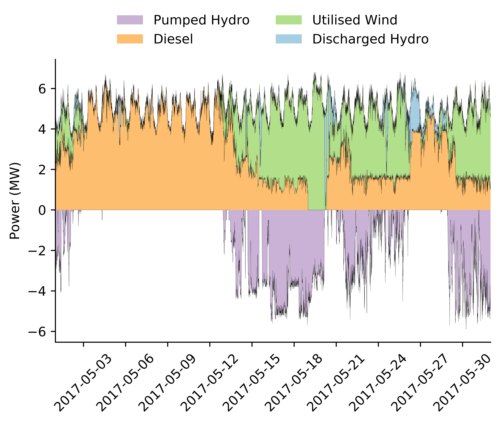

# El Hierro

This repository contains the work used for a project evaluating the potential for renewable power on the island of El Hierro. The project analyses the current way in which the generation assets on El Hierro are being utilised and optimises a simulated grid with the intent of identifying the least cost path to achieve high renewable penetrations.

The conclusion was that in order to achieve 99.5% renewable penetration, the cheapest system was comprised of a battery with 100 MWh capacity and a power rating of 10 MW, 15x 2.3 MW turbines, and 8000x 3 kW solar panels. This came to a total cost of $195M, ca.8x the price of reaching 60% renewable penetration, with $72M for the battery and remaining costs almost evenly split between wind and solar. 

Data Sources:
* Demand and supply for the current grid was sourced from the Spanish NSO: Red Eléctrica de España
* Frequency data was provided by Rainer Strassburger
* Solar data was sourced from SunLab 
Wind generation data was sourced from Wunderground

 

  </img>

Figure 1. Example week

